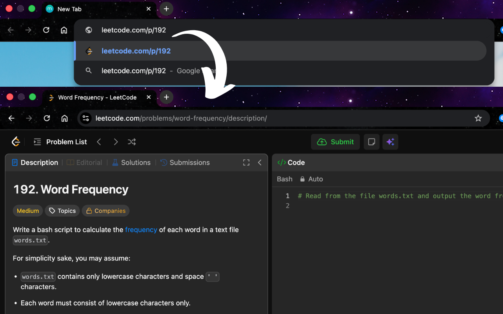

<h1>
    
    &nbsp;LeetJump - LeetCode Problem ID Redirect
</h1>

Quickly jump to official LeetCode problem pages using numeric Problem IDs / Problem Numbers (e.g. #2, #14, #19, #192, #811). Lightweight, ultra-fast, 100% open-source Chrome extension powered by a multi-tiered caching & API fallback architecture.

🚀 **Navigate LeetCode problems instantly using numeric Problem IDs with zero setup and zero key requirements.**

> 🔗 Looking for the Chromium version? Check out [LeetJump](https://github.com/LeetJump/LeetJump).

---

## ✨ Features

- ⚡ **Instant Redirection**: Automatically intercepts numeric URLs before page load and redirects to official problem slugs.
- 🌐 **Dual Domain Support**: Works seamlessly on both `leetcode.com` and `leetcode.cn` (LeetCode China).
- 🔗 **Flexible Short URLs**: Type `leetcode.com/p/1`, `leetcode.cn/problem/1`, or `leetcode.com/problems/1` to jump straight to `/problems/two-sum/`.
- 🛡️ **Passthrough Protection**: Valid routes like `/problems/two-sum/`, `/contest/`, `/explore/`, `/discuss/`, etc. are preserved and left untouched.
- 📦 **Offline & Remote Fallback**: Includes a fallback mapping for 4,000+ problems updated via automated generator script.
- 🔒 **Minimal Permissions**: Requires only `webNavigation` and `storage` scoped specifically to LeetCode domains and raw fallback endpoints.
- 🌟 **100% Open Source**: Transparent, community-driven, and completely free to use.

---

## ⚡ Data Priority & Architecture

LeetJump utilizes a multi-tier fallback sequence to guarantee near-instantaneous redirects:

| Priority               | Data Source            | Details                                                                                                                     |
| :--------------------- | :--------------------- | :-------------------------------------------------------------------------------------------------------------------------- |
| **1. Memory Cache**    | In-Memory Object       | Instant lookup during service worker lifetime.                                                                              |
| **2. Local Storage**   | `chrome.storage.local` | Saved locally for quick cross-session reuse (24-hour TTL).                                                                  |
| **3. GraphQL API**     | LeetCode GraphQL       | Fetches live question list directly from LeetCode.                                                                          |
| **4. REST API**        | `/api/problems/all/`   | Direct REST endpoint query fallback.                                                                                        |
| **5. Remote Fallback** | GitHub Raw CDN         | Remote fallback backup (`https://raw.githubusercontent.com/LeetJump/fallback/main/fallback.json`) covering 4,000+ problems. |

---

## 🌐 Compatible Browser

> Requires Firefox 140 or later.

---

## 📦 Installation

1. **Download & Extract**: Download or clone this repository to your computer.
2. **Open Debugging**: Open Firefox and navigate to `about:debugging#/runtime/this-firefox`.
3. **Load Add-on**: Click **"Load Temporary Add-on…"**.
4. **Select Manifest**: Select the `manifest.json` file inside the `firefox/` directory.
5. **Done!** Open any supported LeetCode URL to start jumping!

---

## 🛠️ Supported URL Examples

| Input URL                                | Intercepted ID | Final Redirect                                       |
| :--------------------------------------- | :------------- | :--------------------------------------------------- |
| `https://leetcode.com/p/1`               | `1`            | `https://leetcode.com/problems/two-sum/`             |
| `https://leetcode.com/problem/42`        | `42`           | `https://leetcode.com/problems/trapping-rain-water/` |
| `https://leetcode.com/problems/200`      | `200`          | `https://leetcode.com/problems/number-of-islands/`   |
| `https://leetcode.com/problems/two-sum/` | _None (Slug)_  | _Passes through untouched_                           |

---

## 📄 License

MIT License. Free to use and distribute.
